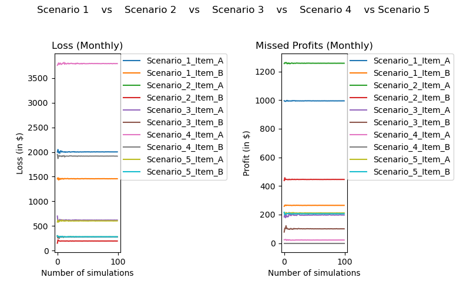

# Project Enhancement: Perishable products Inventory Management using MC Simulation
##### [Original Project]("https://github.com/LalitaTakle/2021Fall_finals")

Goods such as fresh food (unprocessed dairy products), meat, some pharmaceutical products etc. require special attention in the inventory management models because of their perishability.
In case of such products restocking strategy becomes critical in managing stock, avoiding wastage and maximizing profits.

### Objective

While the original project's objective was to test out 3 different restocking strategies through monte carlo simulation and calculate profit and loss
for each of the strategies. 

In this project, we improve and enhance the code and implementation of the inventory management simulation carried out earlier and test out two more scenarios.

## Original Scenarios
| Scenario | Restocking Upto | Restocking Interval
| ----------- | ----------- | ----------- |
| 1 | Full | Weekly |
| 2 | Cumulative Previous Demand | Weekly |
| 3 | Cumulative Previous Demand | On Expiry |

## New Scenarios
| Scenario | Restocking Upto | Restocking Interval |
| ----------- | ----------- | ----------- |
| 4 | Full | When stock < 10% of Maximum Capacity |
| 5 | Cumulative Previous Demand | At Product Expiry Days |

## Assumptions
Assumptions made to build the original model, that extend to our improvements as well:
1. In each simulation, we are performing the experiment for 28 days i.e. a month.
2. Considering 2 items: A and B. A has a very low-shelf-life i.e. 3 days whereas B has a relatively higher 5 day shelf life.
3. Storage capacity for each product is 100 and it is fixed.
4. Cost per product A is 20$ and that per product B is 15$
5. Profit per product A is 4$ and that per product B is 3$
6. We check for defective items while restocking.

Note: While the assumptions stay the same, these hard coded assumptions have now been made dynamic and user inputted.

## Project Improvements

### Code Improvements
1. Removed the hard coded product metrics and created a product class that contains all the specific attributes of a product and 
methods related to a product.
2. Instead of hard coding the products, made the system more useful by giving the user the option to add products or load the same from a csv file.
3. Updated the plots being made to increase their visibility.
4. Segmented the code further down for ease of understanding and testing.

### Implemenation Improvements
1. Earlier, items were being sold only when the demand was less than then available stock. Now, when the demand is greater than the 
available stock, the entire stock is sold off.
2. While defective items were being calculated and used in the financial calculations, these were not being dropped from the available stock after restocking. 
Now these are being dropped.

## Result
We were able to regenerate the results for the hypotheses tested originally and test out two more hypotheses. Furthermore, we made the code more dynamic, scalable and reliable.
